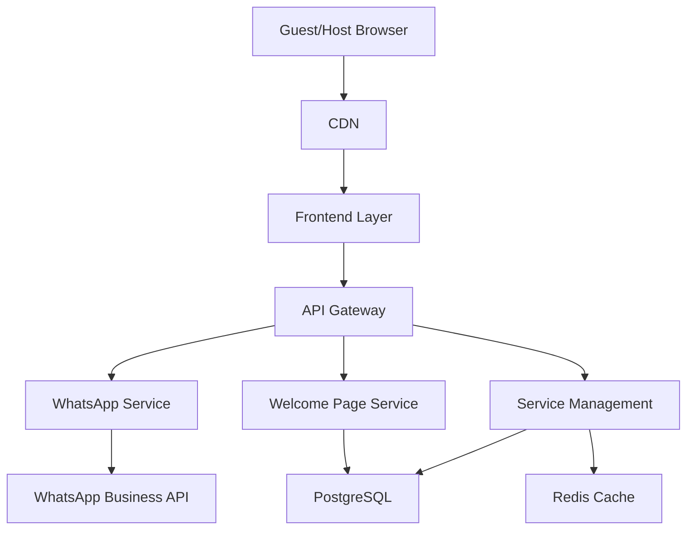
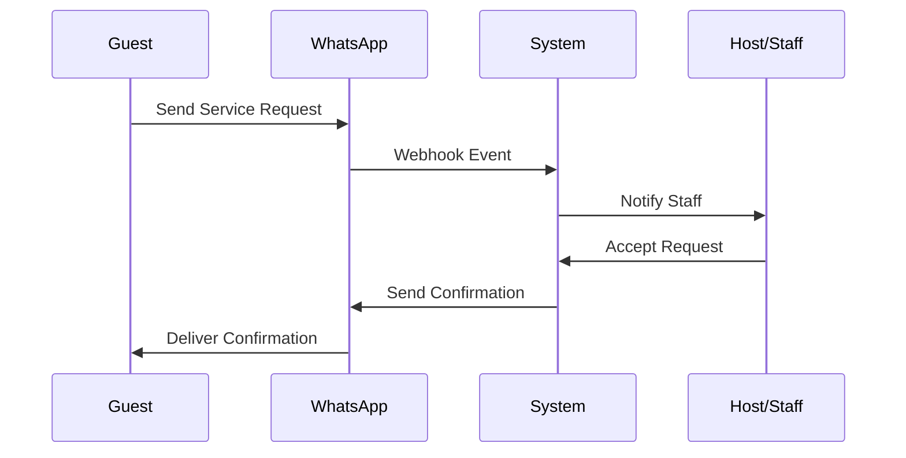
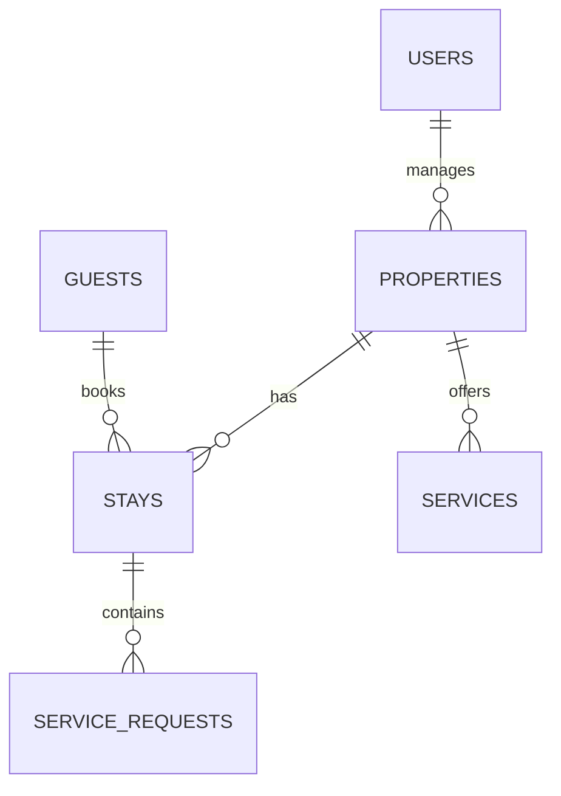

# Architecture Design Document

**Document Version:** 1.0  
**Date Created:** September 15, 2025  
**Author(s):** AI-Generated  
**Project Name:** Guest Link - A WhatsApp-based Hospitality App

---

## 1. Introduction
This Architecture Design Document outlines the technical architecture for Guest Link, a WhatsApp-integrated hospitality management platform. Building upon the Project Overview and Requirements Specification, this document details the system's structure, components, and interactions required to deliver a seamless experience for hosts, guests, and staff members.

The architecture prioritizes several key goals:
- Robust WhatsApp integration for reliable communication
- Secure and scalable welcome page generation
- Real-time service request handling
- Data privacy and compliance
- System modularity for maintainable development
- High availability for critical features

The design assumes cloud-based hosting, WhatsApp Business API availability, and modern web standards support. This document will guide development while ensuring alignment with our KPIs of 99.9% uptime and sub-2-second page loads.

---

## 2. High-Level Architecture Overview
Guest Link implements a microservices-based architecture centered around the WhatsApp integration service. The system uses Next.js for the web application, Node.js microservices for specialized functions, and a combination of PostgreSQL and Redis for data management. Real-time features are handled through WebSocket connections and WhatsApp webhook integrations.

```
                                    +----------------+
Guest/Host Devices                  |   CDN Layer   |
(Web/Mobile) <----------------+    |  (CloudFront)  |
                             |    +----------------+
                             |           ↑
                             ↓           |
                     +------------------+
WhatsApp Business    |   Frontend Layer |
API <------------->  | (Next.js/React)  |
                     +------------------+
                             ↑
                             ↓
                    +-------------------+
                    |  Backend Services |
                    +-------------------+
                      ↑     ↑      ↑
                      |     |      |
         +------------+     |      +------------+
         ↓                  ↓                   ↓
  +-----------+    +-----------+    +------------------+
  | PostgreSQL |    |   Redis   |    | Media Storage   |
  |  (Primary) |    |  (Cache)  |    |    (S3)        |
  +-----------+    +-----------+    +------------------+
```

---

## 3. System Layers

### 3.1 Frontend Layer
- **Responsibilities:**
  - Responsive web interfaces for hosts and staff
  - Welcome page rendering and management
  - Real-time status updates
  - Progressive Web App functionality
  
- **Technologies:**
  - Next.js 13+ with App Router
  - React for component architecture
  - Tailwind CSS for styling
  - Service Workers for offline capability
  
- **Key Components:**
  - Welcome Page Generator (`app/welcome/[stayId]/page.tsx`)
  - Host Dashboard (`app/dashboard/page.tsx`)
  - Service Management Interface (`app/services/page.tsx`)
  - Real-time Chat Components (`components/chat/`)
  
- **Data Flow:**
  - Server-side rendering for welcome pages
  - Client-side updates via WebSocket
  - React Query for data caching
  - Local storage for offline support

### 3.2 Backend Layer
- **Responsibilities:**
  - WhatsApp message handling
  - Welcome page generation
  - Service request coordination
  - Authentication and authorization
  
- **Technologies:**
  - Node.js microservices
  - Express.js for API endpoints
  - WhatsApp Business API client
  - JWT for authentication
  
- **Key Services:**
  - WhatsApp Service (message handling)
  - Welcome Page Service (page generation)
  - Service Coordination Service (request management)
  - Analytics Service (data processing)
  
- **Data Flow:**
  - REST APIs for CRUD operations
  - WebSocket for real-time updates
  - Message queues for async processing
  - Webhook handlers for WhatsApp events

### 3.3 Data Layer
- **Responsibilities:**
  - Guest and stay data storage
  - Message history archival
  - Service request tracking
  - Analytics data management
  
- **Technologies:**
  - PostgreSQL for primary data
  - Redis for caching/real-time data
  - Amazon S3 for media storage
  
- **Schema Overview:**
```prisma
model Property {
  id          String   @id @default(uuid())
  name        String
  host        User     @relation(fields: [hostId], references: [id])
  hostId      String
  stays       Stay[]
  services    Service[]
  createdAt   DateTime @default(now())
}

model Stay {
  id          String   @id @default(uuid())
  property    Property @relation(fields: [propertyId], references: [id])
  propertyId  String
  guest       Guest    @relation(fields: [guestId], references: [id])
  guestId     String
  startDate   DateTime
  endDate     DateTime
  whatsappNumber String?
  welcomePageUrl String  @unique
  status      StayStatus
  requests    ServiceRequest[]
}

model ServiceRequest {
  id          String   @id @default(uuid())
  stay        Stay     @relation(fields: [stayId], references: [id])
  stayId      String
  service     Service  @relation(fields: [serviceId], references: [id])
  serviceId   String
  status      RequestStatus
  createdAt   DateTime @default(now())
  completedAt DateTime?
}
```

### 3.4 Integrations Layer
- **Responsibilities:**
  - WhatsApp Business API integration
  - Payment processing (future)
  - Email notifications
  - Cloud storage management
  
- **Technologies:**
  - WhatsApp Business API
  - AWS SDK for S3
  - SendGrid for emails
  - Stripe API (planned)
  
- **Integration Patterns:**
  - Webhook handlers for external events
  - Queued message processing
  - Retry mechanisms with exponential backoff
  - Circuit breakers for external services

---

## 4. Design Patterns

### 4.1 Microservices Architecture
- Separate services for WhatsApp, welcome pages, and service management
- Independent scaling and deployment
- Service discovery and load balancing
- Inter-service communication via message queues

### 4.2 Event-Driven Architecture
- WhatsApp webhook events trigger system actions
- Real-time updates via WebSocket
- Message queues for asynchronous processing
- Event sourcing for service request tracking

### 4.3 CQRS (Command Query Responsibility Segregation)
- Separate read and write models for analytics
- Optimized query paths for welcome pages
- Event sourcing for service request history
- Cached read models for dashboard data

### 4.4 Repository Pattern
- Abstracted data access layer
- Consistent interface for data operations
- Simplified testing and maintenance
- Support for multiple data sources

---

## 5. Scaling Strategies

### 5.1 Horizontal Scaling
- Container orchestration with Kubernetes
- Auto-scaling based on load metrics
- Regional deployment for lower latency
- Load balancing across instances

### 5.2 Data Scaling
- PostgreSQL read replicas for analytics
- Redis cluster for distributed caching
- S3 with CloudFront for media delivery
- Database sharding by property/region

### 5.3 Performance Optimization
- CDN for static assets
- Edge caching for welcome pages
- WebSocket connection pooling
- Lazy loading for dashboard components

### 5.4 Reliability
- Multi-region deployment
- Automated failover
- Circuit breakers for external services
- Rate limiting and throttling

---

## 6. Diagrams

### System Component Interaction


### Service Request Flow


### Data Model Relationships


---

## 7. Risks and Assumptions

### Assumptions
- WhatsApp Business API remains stable and accessible
- Users have reliable internet connectivity
- Cloud infrastructure provides required uptime
- Staff members can access web dashboard
- Peak loads are predictable by region/time

### Risks
- WhatsApp API limitations or changes
  - Mitigation: Message queuing and rate limiting
- Data privacy compliance challenges
  - Mitigation: Regular audits and encrypted storage
- System scalability under peak loads
  - Mitigation: Auto-scaling and load testing
- Real-time communication failures
  - Mitigation: Fallback to polling and retry logic

---

## 8. Revision History
- September 15, 2025 - v1.0 - Initial architecture design document
- Future updates will be logged here

---

**Document Purpose Recap:** This Architecture Design Document provides a comprehensive technical blueprint for Guest Link's implementation, ensuring scalability, security, and maintainability while meeting the specific requirements of a WhatsApp-integrated hospitality management platform.